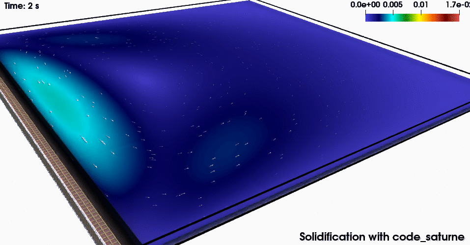
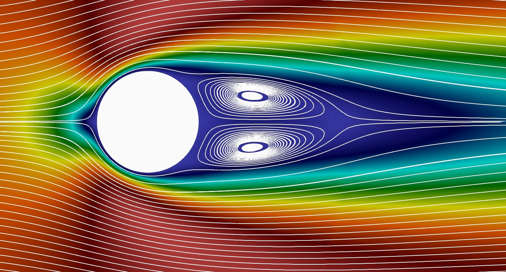
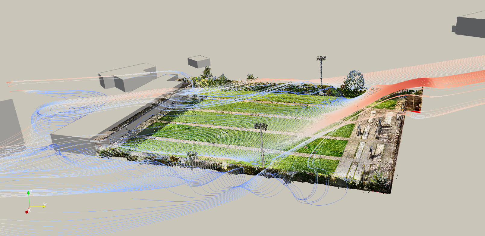

# Who I am :v:
Hi y'all! :wave: On `GitHub` I go by the name of `@RiMillo`, but my real name is Riccardo. I'm :it: and :fr:, currently based in Paris.

# What I did
For a detailed *formal* presentation, have a look at my resume:

* English :uk: [here](./CV_ENG.pdf)
* Italiano :it: [qui](./CV_ITA.pdf)
* Français :fr: [par ici](./CV_FRA.pdf)

I have obtained two MSc in Engineering/Applied Mathematics from of Politecnico di Milano :it: (Ingegneria Matematica) and École polytechnique :fr:. I have a [PhD](https://tel.archives-ouvertes.fr/tel-03080530) in Applied Mathematics (Numerical Analysis for Fluid Dynamics) from CERMICS (ENPC, France :fr:) and EDF.

 

# What I do
Currently, I am a Post-Doc research fellow at CEREA (ENPC, France :fr:) and part of the Sciences^2024 program which uses physics and mathematics to give a scientific characterization of some sports and helps athletes in their training on the road towards Paris 2024 Olympic Games. Our focus is archery: find the best arrow for a given atmospheric setting.

    

# What I can do
I have an engineering background (BSc and 2x MSc) with two main axes: mathematics and computer sciences. I like coding. My language of predilection is `C/C++` which I used in numerous scientific projects and for my PhD (hybrid parallelism `MPI x OMP` included).

I try to learn new stuff every day, currently exploring `python` (statistical analysis, computer vision, I might also dust off some notes from the Data Mining and ML courses at PoliMi) and `GO`.

I have heard all the best about `Rust` and I am very curious about `CUDA`: they are on my todo list, I plan to have a look at them soon!

FYI, I like `LaTeX`, too: [spoiler alert: self promotion] checkout this [`GitHub` repo](https://github.com/RiMillo/LaTeX_tips) about `LaTeX` Tips&Tricks.

# What makes me dream
As you guessed, I'm passionate about mathematics and sports and I hope to make a job out of this. I have a special interest for fluid dynamics and my dream is to work in a team responsible for the design of a F1 race car :red_car::checkered_flag: or a sailboat :sailboat:.

# What I would like to do
I'd like to work in the research and development branch of a company as developer of a scientific tool / software. The applications in which I would like to be involved are fluid dynamics and anything that is bio-related or health-driven (e.g. computational conception of new pharmaceutical drugs,...): combining all the three (e.g. hemodynamics) would be just great!

# Let's get in touch!
Hit me up on [LinkedIn](https://www.linkedin.com/in/milanir/)! Otherwise, my contact details are in the resume.
